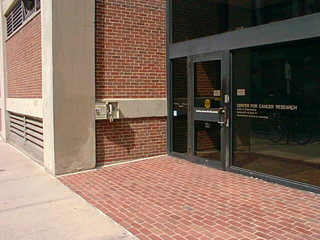
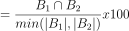
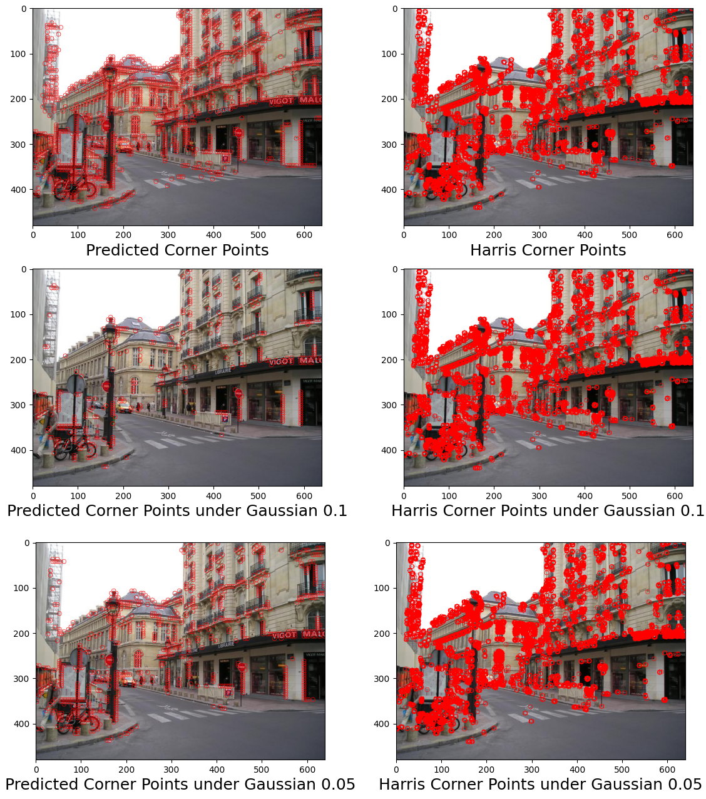
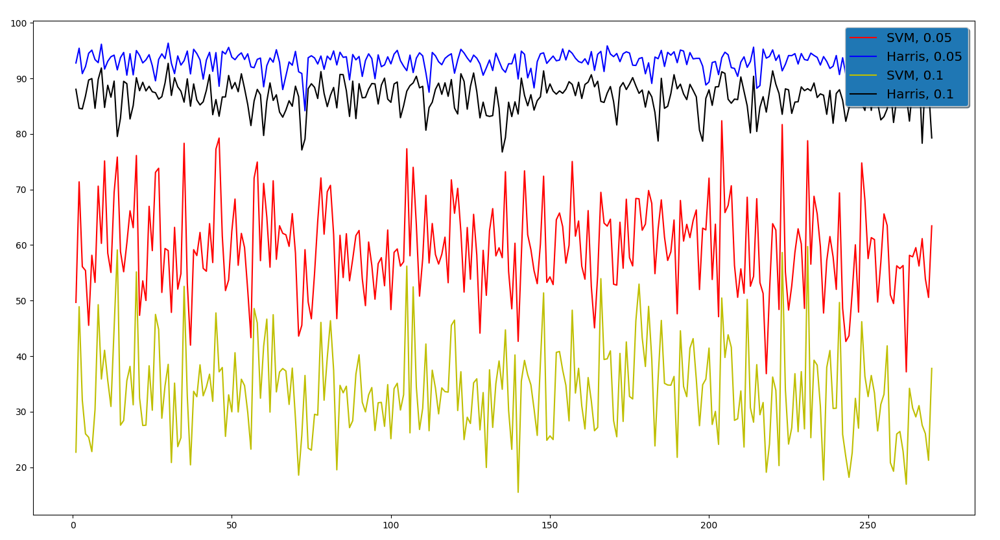
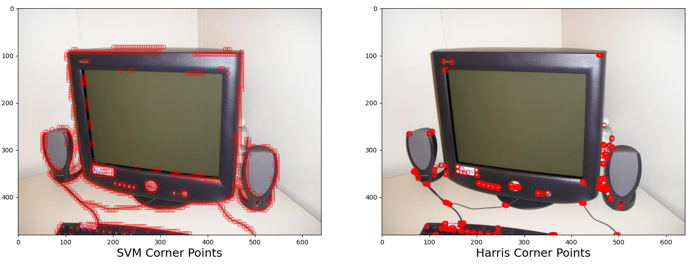
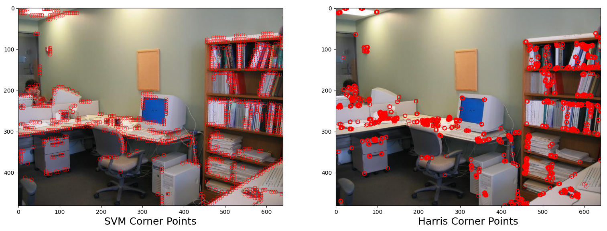

## Corner Detection with SVM

#### Description

Corner detection is an approach to infer the content of an image while providing features for 3D reconstruction, object recognition, motion detection etc. Harris Corner Detector, one of the frequently used methods, calculates a score for each point in an image by considering the intensity differentiation of a small region around the point. Then the state of a point, whether a corner or non corner, is decided by checking the score if its bigger than a threshold or not. Yet, in this project, it is aimed to detect corners using the Support Vector Machine structure where it is trained with feature vectors of corner and non corner points.

#### Dataset

Since the corners are the points of gradient differentials, the dataset must consists of images with high texture to clearly discriminate the corner and non corner points. To this end, a public dataset that has been used for semantic segmentation named **Barcelona Dataset**, **released by University of North Carolina at Chapel Hill**, is selected. The dataset contains 2688 images, each in shape of **640 x 480**, and **33 labels** from sidewalk to office view. Yet, in order to satisfy the lots of texture requirement, images of the building, sidewalk and office view were selected and others were eliminated. Number of elements of the dataset was **reduced to 270** after this selection criteria. So that, the dataset used to train and test the model consists of 270 images, in shape of 640 x 480 pixels. From each image in the dataset, **nearly 4000 points were selected as corner and non corner**, 2000 for each. As a consequence, this selection led to **872.330 training** and **96.998 testing points**.

  

#### Training & Testing Steps

There are two parameters, constituting four combinations, that affect the robustness of the method which are the size of the region around the points and the feature vector calculation procedure. Therefore, in order to test their effect, four combinations were separately tested to employ the most robust one as the method.

1. Regions around the points are in size of **5x5 pixels**. Feature vectors are calculated as the concatenated gradients in X and Y directions. So a feature vector is in length of **25 + 25 = 50**.

2. Regions around the points are in size of **5x5 pixels**. Feature vectors are calculated as the concatenation of the gradients and their magnitudes. So a feature vector is in length of **25 + 25 + 25 = 75**.

3. Regions around the points are in size of **7x7 pixels**. Feature vectors are calculated as the concatenation of the gradients. So a feature vector in is length of **49 + 49 = 98**.

4. Regions around the points are in size of **7x7 pixels**. Feature vectors are calculated as the concatenation of the gradients and their magnitudes. So a feature vector is in length of **49 + 49 + 49 = 147**.

---

These four combinations are separately examined to select the appropraite configuration. General steps for the training and testing of the model are given below.

- For corner points, Harris is applied to an image and points with a score bigger than **0.01 x maximum score** are selected.

- For non corner points, **magnitude of the X and Y gradients** around a point, 5x5 or 7x7 frame, is calculated. Points having less magnitude score than a threshold are selected as non corner points since there is not so much change which lead to small magnitude of gradients.

- Gradients of X and Y directions around points, 5x5 or 7x7 frame, are calculated. In addition, the **magnitude of the gradients** are also calculated for 2 configurations to check their effect on the model accuracy. The matrices produced by these calculations are reshaped to be 1D, **of length 25 or 49**, and stacked to create a one feature vector of length **50, 75, 98 and 147 with respect to the configurations** stated above.

- The feature vectors are shuffled with the corresponding labels and partitioned **into training and testing sets by 90% and 10% ratios respectively**. Then SVM is trained with the training feature vectors and the corresponding labels.

- Trained SVM models are then tested on the feature vectors separated for testing.

---

The table below shows the scores achieved by different configurations of SVM.

| Configuration               	| Kappa 	| Accuracy 	| Precision 	| Recall 	| F1   	|
|-----------------------------	|-------	|----------	|-----------	|--------	|------	|
| 5x5 frame without magnitude 	|  0.31 	| 0.51     	| 0.51      	| 0.54   	| 0.51 	|
| 5x5 frame with magntiude    	| 0.88  	| 0.93     	| 0.94      	| 0.94   	| 0.94 	|
| 7x7 frame without magnitude 	| -0.32 	| 0.33     	| 0.21      	| 0.34   	| 0.26 	|
| 7x7 frame with magnitude    	| 0.99  	| 0.99     	| 1.00      	| 1.00   	| 1.00 	|

As shown on the table, including the magnitude of the gradients helps for better discrimination of corner and non corner points. Also, considering a broader frame, 7x7 instead of 5x5, seems more discriminative with magnitude information yet this model overfit the dataset and performes worse when considering with Harris. Therefore, the model to employ is configured to consider 5x5 frame around points and process the magnitude infromation along with the gradients.

#### Comparison with Harris Corner Detector

In order to compare the SVM corner detector with the Harris method **two metrics are employed** that measures **the speed of the methods** and **their robustness under Gaussian noise**. To measure the robustness under Gaussian Noise, a method proposed by Jie Chen et al. in 2009 was employed. They proposed a method named anti-noise factor ρ which is defined as :

  

where B​1 is the corner set of a image and B​2 is the corner set of an image under the Gaussian noise. Therefore, greater the ρ better the method under a Gaussian noise. 

---

- In order to compare the speed of the methods, each image in the dataset is read, SVM and Harris methods are applied to the image respectively and the elapsed time during the calculations is collected. **Average calculation time of the SVM** model is **0.33 seconds** while **Harris method** take nearly **0.006 seconds**. Reason for the SVM to consume nearly **50  times more** time is generating the test points and corresponding feature vectors for the image. Nevertheless, Harris method is so faster than the SVM model with respect to these results.

- In addition to the evaluation of the speed of the methods, their **robustness under Gaussian noise** is measured to compare the methods. As explained in the algorithmic steps section, **anti-noise criterion** is employed to check if the corner detection method finds the same points as the corner or not and by how many. To this end, methods are tested on both noisy and normal images. **Two Gaussian noises with 0.05 and 0.1 sigma values** are applied separately to every image in the dataset and then the images are tested with the methods.

  

Figure below shows the anti-noise score of the methods under **Gaussian noises with 0.05 and 0.1 sigma values**. As shown above, **more the noise was less the performance achieved**. Yet, **Harris** detector **seemed considerably more robust** under more Gaussian noise. On the other hand, **SVM** corner detector seemed **applicable under little noises**.

  

As a consequence, **Harris** corner detector **performs better regarding speed and robustness** comparison. For the speed comparison, Harris make the calculations approximately **50 times faster** than the SVM model. Also, Harris **nearly finds the same corner points under high and low Gaussian noises** yet **SVM model is only able to find acceptable corner points** under low noise.

#### Comparison Examples

  

  

#### Usage

For training;

- **Images of the dataset** must be placed under an **"img"** folder at the same directory. **Model path** and **region size**, **5 or 7** for example, must be given as a command line parameter like **"./main.py -m model_name -r 5"**. After training, it will **produce scores** for the test set. In addition, a model with the given model name **will be placed** at the same directory. 

For testing on images;

- The same directory as the training can be used to check how the model finds the corners. To this end, **"./main.py -t -m model_name -r 5"**, for example if frame size is 5x5, can be used to **see output of the SVM** model as above, image by image.